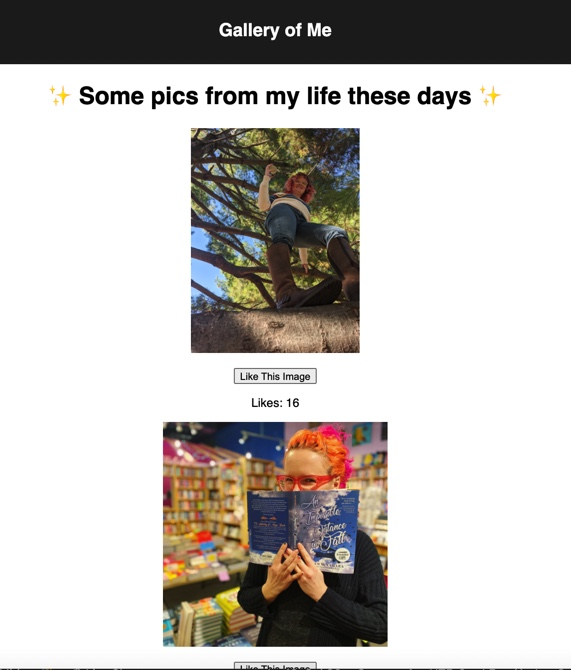
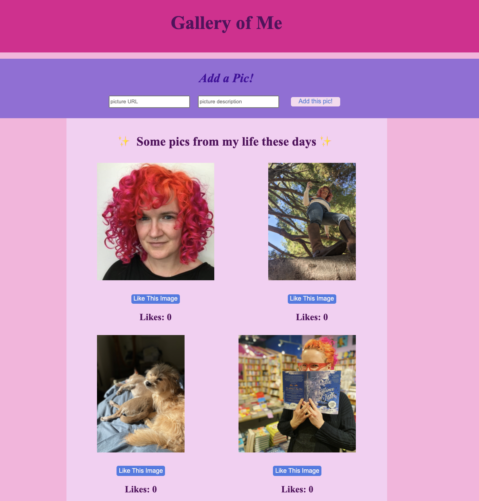

# Project Name

GALLERY OF ME

## Description

The assignment was to create a gallery of photos using React with the ability to toggle between the image and the alt text and the ability to like photos. The stretch goals I completed were adding a database and the ability to add photos to the gallery.

BASE MODE took me about 3 1/2 hours, 4 hours including adding comments. I then added some stretch goals while also troubleshooting with others on our projects, which took me another 5+ hours. 

## Screenshots

This is what it looked like for base mode and when I was finished: 




## Prerequisites

Node.js
install express and PG
database and table created according to the database.sql file

## Installation

Phase 1: Get everything mounted and communicating properly
===

- put six images into the images folder, and update the gallery.router.js to create an object for each image within a gallery array
- create a _template folder and _template.jsx to use when creating components
- create a GalleryList component and a GalleryItem component
- import and mount the components and test them out in the browser
- import axios and useState and create a function that gets the images from the server, stores them in App.js and passes them to the GalleryList via props
- import useEffect and use it to get the images on page load
- send the images as props to the GalleryList, map through the array to create a separate GalleryItem for each object by mounting and sending props separately for each one
- in GalleryItem, display the image, description and likes and test that everything is communicating properly

Phase 2: Add the details

- add a hook, function, onClick, and condition in the GalleryItem component so that the image and desription will swap out when you click on it (conditional rendering)
- Display the number likes for each item and add a like button.

    - When the like button is clicked, use `Axios` to update (`PUT`) the like count `/gallery/like/:id`. The PUT request needs to be linked to the props.item.id. It looks like this:
    ```
    console.log( 'in updateLikes' );
        axios.put( `/gallery/like/${props.image.id}` ).then( (response)=>{
            console.log( response.data );
          } ).catch( (err)=>{
            alert( 'nope' );
            console.log( err );
          })
    ```
    (I'm not sure why we are suddenly using bling again?)
    - Update the gallery each time a like button is clicked, by calling the getImages function in the galleryItem component? To do this, pass the getImages function down from App.js all the way to the GalleryItem.

STRETCH GOALS COMPLETED

***remember to branch and merge for each stretch goal!***

Phase 3: Add the database
- create a new branch to work in, and a branch to push to
 - create a database in Postico that includes id, path, description, and likes, and move the data from the server into the database.
- npm install pg
- create a database.sql in the project so that it can be recreated.
- create a pool module in the server, make sure it's using the right database,export it and require it in the router.js
- in the routes file, edit the GET and PUT requests so that they pull from and push to the database.

Phase 4: Adding an addImage component
- create a new branch to work in.
- create a new component using _template and import and mount on the DOM.
- In the component, add inputs and a button, then a hook and function to capture the input data, bundle it into an object, and pass it to the server using axios POST.
- Add server side route for posting the image to the database and pass getImages to the new component using props so that the DOM refreshes once the image is posted.
- I had intended to clear the input fields in this function, but ran out of time before I could add it.

(Phase 4 1/2: Added some basic styling.)

## Usage

The user can alternate views between images and the alt text, like images and see how many times the image has been liked, and add an image and alt text to the gallery that will then be displayed on the page.

## Built With

- Express, PG, React
- Javascript and SQL

## Acknowledgements

This was a tough one! Thanks to everyone in my cohort, and to Dev, for helping out along the way.

## Support

Holler at me on Slack if you need any help installing this project.
